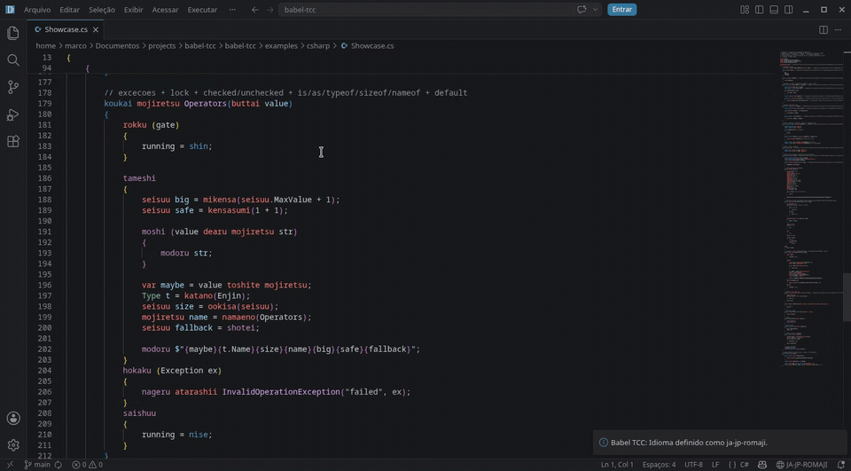
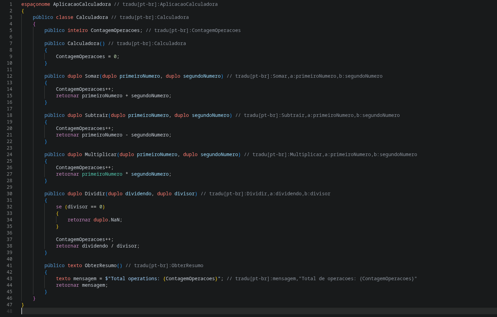
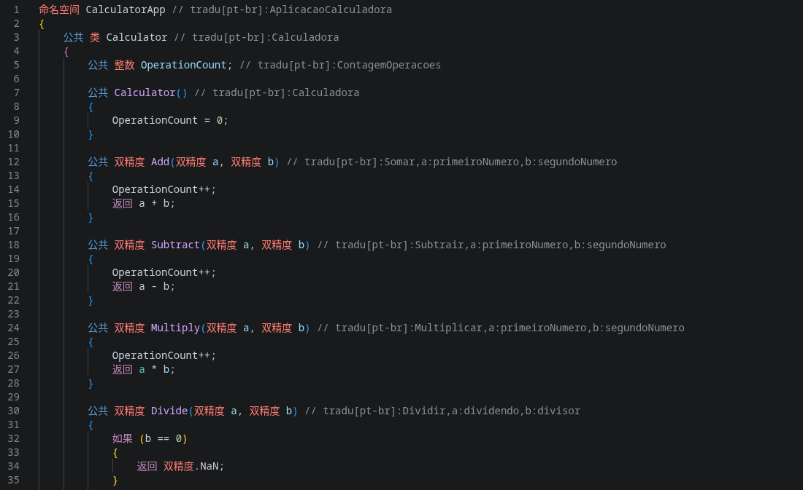
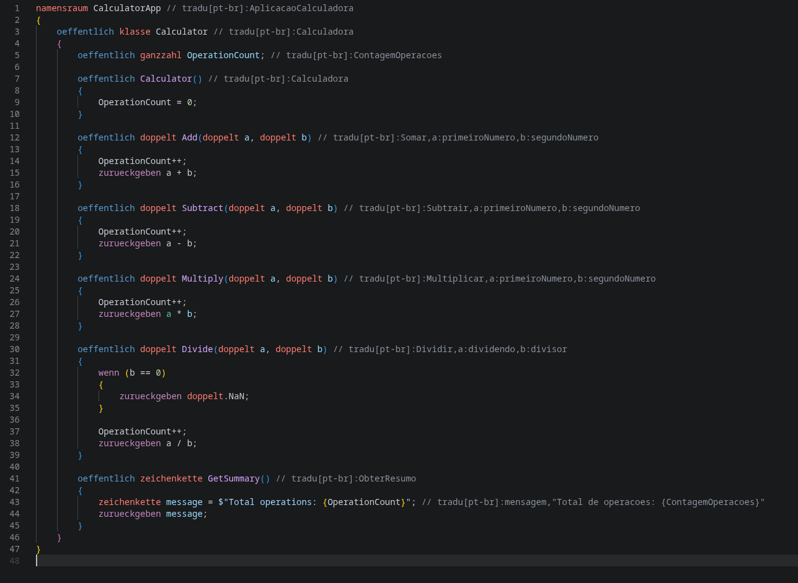
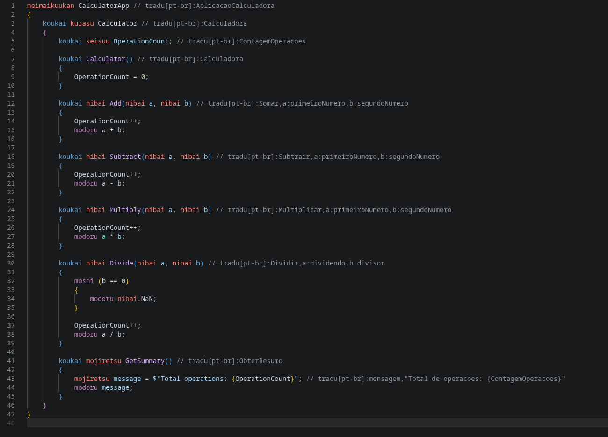

# Babel TCC - MultiLingual Code

[](https://github.com/NFAsylum/babel-tcc/actions/workflows/ci.yml)

[Portugues](README.md) | **English** | [Espanol](README.es.md)

VS Code extension that visually translates programming code in real time, keeping the original files untouched on disk.



## What does it do?

Developers write code in C# or Python, and the extension displays the keywords and identifiers translated into the configured language (PT-BR, ES-ES, etc.). On save, the code automatically reverts to the original programming language.

**Before (original C# on disk, with `// tradu` annotations on the identifiers):**
```csharp
using System;

namespace HelloWorld // tradu[pt-br]:OlaMundo
{
    class Program // tradu[pt-br]:Programa
    {
        static void Main(string[] args) // tradu[pt-br]:Principal,args:argumentos
        {
            Console.WriteLine("Hello, World!");
        }
    }
}
```

**After (what a PT-BR developer sees in the editor; the `// tradu` comments stay visible):**
```csharp
usando System;

espaçonome OlaMundo // tradu[pt-br]:OlaMundo
{
    classe Programa // tradu[pt-br]:Programa
    {
        estático vazio Principal(texto[] argumentos) // tradu[pt-br]:Principal,args:argumentos
        {
            Console.WriteLine("Hello, World!");
        }
    }
}
```

The file on disk always stays in the **original code**. The translation is purely visual.

## Features

- **Visual keyword translation** - C# and Python keywords translated (if->se, class->classe, def->definir, etc.)
- **Identifier translation** - Variable, method and class names via the `// tradu[lang]:` annotation
- **Reverse translation on save** - On save, the translated code reverts to the original on disk
- **Translated autocomplete** - Keyword and identifier suggestions in the configured language
- **Hover with original** - Hovering over a translated keyword shows the original keyword
- **Status bar** - Active language indicator with a quick selector
- **Syntax highlighting** - Custom TextMate grammar for translated keywords
- **Multilingual collaboration** - Multiple developers in the same repo, each seeing their own language
- **Zero impact** - Compilers, CI/CD, Git and IntelliSense work normally
- **Persistent process** - The translation engine runs as a long-lived process, with no cold start per request

## Quick Start

1. Install the extension in VS Code
2. Open a `.cs` or `.py` file
3. Press `Ctrl+Shift+P` and run `Babel TCC: Select Language`
4. Choose `pt-br`
5. The translation appears automatically

## Installation

### Prerequisites

- VS Code 1.85 or higher
- **.NET 8.0 Runtime** — required **only** by the universal package. The per-platform packages
  (Windows/Linux/macOS) bundle the runtime and **do not require .NET to be installed** (see
  [Distribution packages](#distribution-packages)).
- Python 3.8+ — **optional**, needed only to translate `.py` files
- Nothing extra for VisuAlg / Portugol Studio (they operate via Text Scan, with no external parser)

### Distribution packages

The extension is published in two variants (decision DT-010); VS Code, the Marketplace and
Open VSX automatically pick the right package for your system:

| Variant | Who gets it | Needs .NET? | Size |
|---------|-------------|-------------|------|
| Per-platform (self-contained) | Windows, Linux and macOS (x64 and arm64) | No — runtime bundled | larger (~36 MB) |
| Universal (fallback) | Any other platform | Yes — .NET 8.0 Runtime | smaller (~5 MB) |

> The per-platform package needs no **.NET**, but still uses the system's **ICU** library (present by
> default on Windows 10+, macOS and most Linux distros; only minimal environments need to install it,
> e.g. `libicu`).

### From source

```bash
git clone https://github.com/NFAsylum/babel-tcc.git
cd babel-tcc/packages/ide-adapters/vscode
npm install
npm run build
```

To build the `.vsix`: `npm run package` (requires [vsce](https://github.com/microsoft/vscode-vsce))

## Supported Programming Languages

| Programming Language | Extension | Keywords | Mode |
|--------------------------|----------|----------|------|
| C# | `.cs` | 89 | Roslyn + Text Scan, supports tradu |
| Python | `.py` | 35 | CPython subprocess + Text Scan, supports tradu |
| VisuAlg (Claudio Morgado) | `.alg` | 48 | Text Scan keyword-only, case-insensitive |
| Portugol Studio (UNIVALI) | `.por` | 26 | Text Scan keyword-only, case-sensitive |

## Available Languages

Portuguese (PT-BR), ASCII Portuguese, English, Spanish, French, German, Italian, Japanese (Romaji), Chinese, Arabic.

The same `Calculator.cs` shown in four languages — the files on disk stay in the original code:

| Portuguese (PT-BR) | Chinese (zh-cn) |
|:---:|:---:|
|  |  |
| **German (de-de)** | **Japanese — Romaji (ja-jp-romaji)** |
|  |  |

## Architecture

```
VS Code Extension (TypeScript)
        |
    CoreBridge (JSON Lines via stdin/stdout)
        |
Core Engine (C# / .NET 8)
    |           |
CSharpAdapter   PythonAdapter
  (Roslyn)     (tokenize stdlib)
        |
Translation Tables (JSON)
```

| Layer | Technology | Function |
|--------|-----------|--------|
| Core Engine | C# / .NET 8 | Translation engine, parsing via Roslyn and the Python tokenizer |
| Extension | TypeScript / VS Code API | Editor integration |
| Translations | JSON | Keyword tables and mappings |
| Communication | JSON Lines via stdin/stdout | Persistent bridge between TS and C# |

## Configuration

Add to `settings.json`:

```json
{
  "babel-tcc.enabled": true,
  "babel-tcc.language": "pt-br"
}
```

### The "tradu" system

Developers annotate custom identifiers in the code:

```csharp
public class Calculator // tradu[pt-br]:Calculadora
{
    public int operationCount; // tradu[pt-br]:contagemOperacoes

    public int Add(int a, int b) // tradu[pt-br]:Somar,a:primeiroNumero,b:segundoNumero
    {
        operationCount++;
        return a + b;
    }
}
```

A PT-BR developer sees (the `// tradu` annotations stay visible):

```csharp
público classe Calculadora // tradu[pt-br]:Calculadora
{
    público inteiro contagemOperacoes; // tradu[pt-br]:contagemOperacoes

    público inteiro Somar(inteiro primeiroNumero, inteiro segundoNumero) // tradu[pt-br]:Somar,a:primeiroNumero,b:segundoNumero
    {
        contagemOperacoes++;
        retornar primeiroNumero + segundoNumero;
    }
}
```

## Stack

- **Core:** C# / .NET 8, Microsoft.CodeAnalysis (Roslyn)
- **Extension:** TypeScript, VS Code Extension API
- **Tests:** xUnit (C#) + Vitest (TypeScript), 849 tests (667 C#, 182 TS)
- **CI/CD:** GitHub Actions (Ubuntu + Windows matrix)
- **Translations:** JSON

## Project Structure

```
babel-tcc/
  packages/
    core/
      MultiLingualCode.Core/        # Translation engine
      MultiLingualCode.Core.Host/   # Persistent host (stdin/stdout)
      MultiLingualCode.Core.Tests/  # xUnit tests
    ide-adapters/
      vscode/                       # VS Code extension
        src/
          extension.ts              # Entry point
          services/                 # CoreBridge, Config, LanguageDetector
          providers/                # Content, Edit, Save, Completion, Hover
          ui/                       # StatusBar
        test/                       # Vitest tests
        syntaxes/                   # TextMate grammars
  scripts/                          # Translation validation
  tarefas/                          # Task tracking
```

## Documentation

- [Architecture](docs/developer-guide/architecture.md) - Architecture overview and flows
- [Code Conventions](CONTRIBUTING.md#convenções-de-código) - Naming and style
- [Technical Decisions](docs/decisoes-tecnicas.md) - Record of decisions and rationale
- [User Guide](docs/user-guide/) - Installation, usage and configuration
- [Developer Guide](docs/developer-guide/) - How to extend the project

## Contributing

Contributions are welcome! See [CONTRIBUTING.md](CONTRIBUTING.md) for details.

## License

[MIT](LICENSE)
