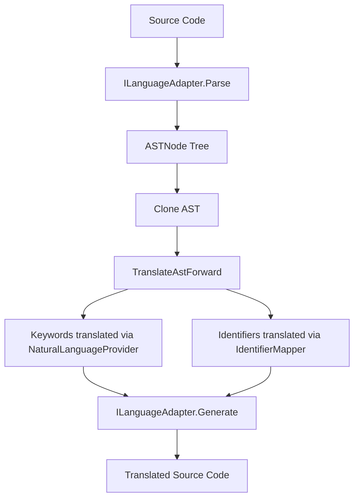

# Referencia da API

## Indice

- [Interfaces](#interfaces)
- [Modelos AST](#modelos-ast)
- [Servicos](#servicos)
- [Fluxo de dados](#fluxo-de-dados)

## Interfaces

### ILanguageAdapter

Interface para adaptadores de linguagens de programacao.

```csharp
public interface ILanguageAdapter
{
    string LanguageName { get; }
    string[] FileExtensions { get; }
    string Version { get; }

    ASTNode Parse(string sourceCode);
    string Generate(ASTNode ast);
    Dictionary<string, int> GetKeywordMap();
    string ReverseSubstituteKeywords(string translatedCode, Func<string, int> lookupTranslatedKeyword);
    ValidationResult ValidateSyntax(string sourceCode);
    List<string> ExtractIdentifiers(string sourceCode);

    // Metodos de suporte a anotacoes tradu (adicionados na tarefa 055)
    List<TrailingComment> ExtractTrailingComments(string sourceCode);
    List<string> GetIdentifierNamesOnLine(string sourceCode, int line);
    string GetFirstStringLiteralOnLine(string sourceCode, int line);
    (int StartLine, int EndLine) GetContainingMethodRange(string sourceCode, int line);
}
```

Implementacoes disponiveis: `CSharpAdapter` (Roslyn) e `PythonAdapter` (subprocesso CPython).

### INaturalLanguageProvider

Interface para provedores de traducao de idiomas naturais.

```csharp
public interface INaturalLanguageProvider
{
    string LanguageCode { get; }
    string LanguageName { get; }

    Task<OperationResult> LoadTranslationTableAsync(string programmingLanguage);
    OperationResultGeneric<string> TranslateKeyword(int keywordId);
    int ReverseTranslateKeyword(string translatedKeyword);
    OperationResultGeneric<string> GetOriginalKeyword(int keywordId);
    OperationResultGeneric<string> TranslateIdentifier(string identifier, IdentifierContext context);
}
```

### IIDEAdapter

Interface para integracao com IDEs (contrato interno).

```csharp
public interface IIDEAdapter
{
    string IDEName { get; }

    Task ShowTranslatedContentAsync(string filePath, string translatedContent);
    Task<EditEvent> CaptureEditEventAsync();
    Task SaveOriginalContentAsync(string filePath, string originalContent);
    Task<List<CompletionItem>> ProvideAutocompleteAsync(string partialText, int position);
    Task ShowDiagnosticsAsync(List<Diagnostic> diagnostics);
}
```

## Modelos AST

### ASTNode (base)

```csharp
public abstract class ASTNode
{
    public int StartPosition { get; set; }
    public int EndPosition { get; set; }
    public int StartLine { get; set; }
    public int EndLine { get; set; }
    public ASTNode Parent { get; set; }
    public List<ASTNode> Children { get; set; }

    public abstract ASTNode Clone();
    public void CopyBaseTo(ASTNode target);
    public static List<ASTNode> CloneChildren(List<ASTNode> children, ASTNode newParent);
}
```

### KeywordNode

```csharp
public class KeywordNode : ASTNode
{
    public int KeywordId { get; set; }
    public string Text { get; set; }
}
```

### IdentifierNode

```csharp
public class IdentifierNode : ASTNode
{
    public string Name { get; set; }
    public string TranslatedName { get; set; }
    public bool IsTranslatable { get; set; }
}
```

### LiteralNode

```csharp
public class LiteralNode : ASTNode
{
    public object Value { get; set; }
    public LiteralType Type { get; set; }
    public bool IsTranslatable { get; set; }
}
```

### ExpressionNode

```csharp
public class ExpressionNode : ASTNode
{
    public string ExpressionKind;
    public string RawText;
}
```

### StatementNode

```csharp
public class StatementNode : ASTNode
{
    public string StatementKind;
    public string RawText;
}
```

## Servicos

### TranslationOrchestrator

Coordena o fluxo completo de traducao.

```csharp
public class TranslationOrchestrator
{
    public required LanguageRegistry Registry { get; init; }
    public required INaturalLanguageProvider Provider { get; init; }
    public required IdentifierMapper IdentifierMapperService { get; init; }

    public static OperationResultGeneric<TranslationOrchestrator> Create(
        LanguageRegistry registry, INaturalLanguageProvider provider, IdentifierMapper mapper);

    public async Task<OperationResultGeneric<string>> TranslateToNaturalLanguageAsync(
        string sourceCode, string fileExtension, string targetLanguage);
    public async Task<OperationResultGeneric<string>> TranslateFromNaturalLanguageAsync(
        string translatedCode, string fileExtension, string sourceLanguage);

    public void TranslateAstForward(ASTNode node, string targetLanguage);
    public void TranslateAstReverse(ASTNode node, string sourceLanguage);
    public void ApplyTraduAnnotations(string sourceCode, string targetLanguage, ILanguageAdapter adapter);
    public void ApplyReverseTraduAnnotations(string code, string sourceLanguage, ILanguageAdapter adapter);
    public string FindScopedTranslation(string name, int line);
}
```

### IdentifierMapper

Gerencia mapeamentos bidirecionais de identificadores.

```csharp
public class IdentifierMapper
{
    public IdentifierMapData Data;
    public string LoadedPath;

    public OperationResult LoadMap(string projectPath);
    public OperationResult SaveMap();
    public void SetTranslation(string identifier, string language, string translation);
    public void SetLiteralTranslation(string literal, string language, string translation);
    public OperationResultGeneric<string> GetTranslation(string identifier, string language);
    public OperationResultGeneric<string> GetOriginal(string translated, string language);
    public OperationResultGeneric<string> GetLiteralTranslation(string literal, string language);
}
```

### LanguageRegistry

Regista e obtem adaptadores de linguagens.

```csharp
public class LanguageRegistry
{
    public OperationResult RegisterAdapter(ILanguageAdapter adapter);
    public OperationResultGeneric<ILanguageAdapter> GetAdapter(string fileExtension);
    public string[] GetSupportedExtensions();
    public bool IsSupported(string fileExtension);
}
```

## Fluxo de dados



### OperationResult Pattern

Todas as operacoes usam `OperationResultGeneric<T>` em vez de exceptions:

```csharp
OperationResultGeneric<string> result = await orchestrator.TranslateToNaturalLanguageAsync(...);
if (result.IsSuccess)
{
    string translated = result.Value;
}
else
{
    string error = result.ErrorMessage;
}
```
