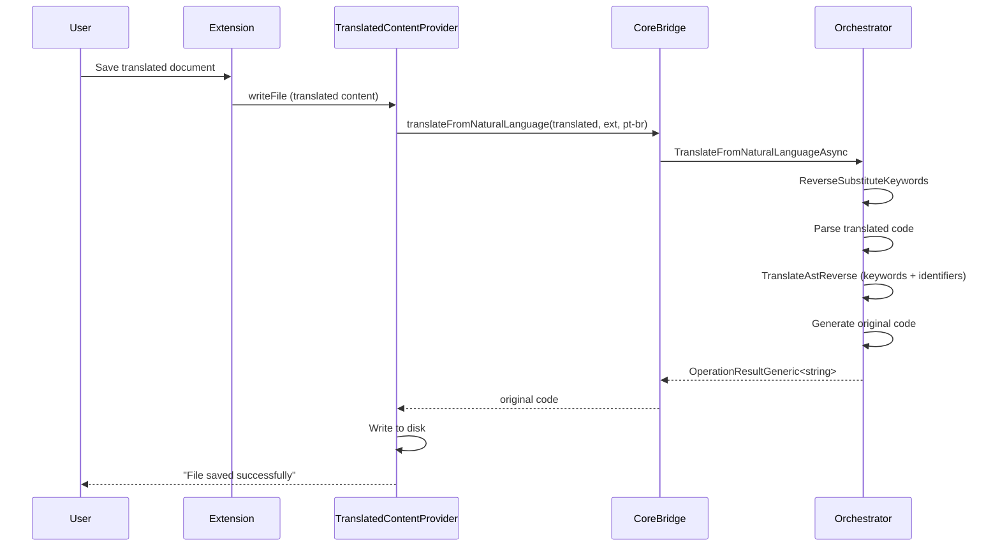

# Arquitetura

## Indice

- [Visao geral](#visao-geral)
- [Camadas](#camadas)
- [Fluxo de traducao](#fluxo-de-traducao)
- [Fluxo reverso](#fluxo-reverso)
- [Decisoes de design](#decisoes-de-design)

## Visao geral

```
+------------------------------------------+
|          VS Code Extension               |
|  (TypeScript)                            |
|                                          |
|  extension.ts                            |
|  +-- StatusBar                           |
|  +-- Commands (toggle, selectLanguage)   |
|  +-- TranslatedContentProvider           |
|  +-- AutoTranslateManager               |
|  +-- CompletionProvider                  |
|  +-- HoverProvider                       |
|  +-- KeywordMapService                   |
|  +-- LanguageDetector                    |
|  +-- ConfigurationService                |
|  +-- CoreBridge                          |
+------------------+-----------------------+
                   |
            CoreBridge (JSON via stdin/stdout)
                   |
+------------------+-----------------------+
|          Core Engine                     |
|  (C# / .NET 8)                          |
|                                          |
|  TranslationOrchestrator                 |
|  +-- LanguageRegistry                    |
|  +-- NaturalLanguageProvider             |
|  +-- IdentifierMapper                    |
|  +-- TraduAnnotationParser               |
+------------------+-----------------------+
                   |
+------------------+-----------------------+
|          Language Adapters               |
|                                          |
|  CSharpAdapter (Roslyn)                  |
|  +-- RoslynWrapper                       |
|  +-- CSharpKeywordMap                    |
|                                          |
|  PythonAdapter (subprocesso CPython)     |
|  +-- PythonTokenizerService              |
|  +-- PythonKeywordMap                    |
|  +-- tokenizer_service.py               |
+------------------+-----------------------+
                   |
+------------------+-----------------------+
|          Data Layer                      |
|                                          |
|  programming-languages/                  |
|    csharp/keywords-base.json             |
|    python/keywords-base.json             |
|  natural-languages/                      |
|    pt-br/csharp.json, python.json        |
|    (10 idiomas x 2 linguagens)           |
|  identifier-map.json                     |
+------------------------------------------+
```

## Camadas

| Camada | Responsabilidade | Tecnologia |
|--------|-----------------|------------|
| Presentation | UI, commands, status bar | TypeScript / VS Code API |
| Providers | Content, auto-translate, completion, hover, keyword map | TypeScript |
| CoreBridge | Comunicacao TS <-> C# | JSON via stdin/stdout |
| Orchestration | Coordenar traducao | C# |
| Adapters | Parsear/gerar codigo | C# / Roslyn (C#), subprocesso CPython (Python) |
| Data | Tabelas de traducao | JSON |

## Fluxo de traducao

O Orchestrator tem dois caminhos de traducao:

### Fast path: Text Scan (arquivos sem tradu)

Para a maioria dos arquivos (sem anotacoes `// tradu`), o Text Scan faz
traducao linear de keywords em 0-1ms para qualquer tamanho de arquivo.

```
User opens .cs/.py → Extension → CoreBridge → Orchestrator
  → Detect: no "tradu" in source
  → Build keyword translation map (adapter + provider)
  → TextScanTranslator.Translate(source, map)
    → Scan linear O(n): skip strings, comments, preprocessor, raw strings
    → Replace keywords with translated equivalents
  → Return translated code (0-1ms)
```

### Full path: Roslyn AST (arquivos com tradu)

Para arquivos com anotacoes tradu, o Roslyn parseia a AST completa
para encontrar e traduzir identifiers alem de keywords.

```
User opens .cs/.py → Extension → CoreBridge → Orchestrator
  → Detect: "tradu" found in source
  → ApplyTraduAnnotations (extract identifier mappings)
  → Adapter.Parse(source) → ASTNode tree
  → Clone AST
  → TranslateAstForward (keywords + identifiers)
  → Adapter.Generate(translatedAst)
  → Return translated code (35-4077ms depending on file size)
```

### Performance (benchmark real, mesma API)

| Linhas | Sem tradu (Text Scan) | Com tradu (Roslyn) | Speedup |
|--------|----------------------|-------------------|---------|
| 435 | 0ms | 35ms | 35x |
| 1710 | 0ms | 162ms | 162x |
| 8510 | 0ms | 1031ms | 1031x |
| 17010 | 1ms | 4077ms | 4077x |

## Fluxo reverso



## Decisoes de design

1. **Arquivo no disco sempre original** (DT-003): Traducao e puramente visual
2. **Comunicacao via processo** (DT-002): stdin/stdout JSON, sem portas de rede
3. **IDs numericos para keywords** (DT-005): Desacopla linguagem de programacao da traducao
4. **Anotacoes tradu** (DT-006): Traducao de identificadores definida pelo desenvolvedor
5. **Roslyn para C#** (DT-001): Parser oficial da Microsoft
6. **Subprocesso CPython para Python**: Tokenizador nativo garante 100% compatibilidade
7. **OperationResult pattern**: Sem exceptions, tratamento explicito de erros
8. **TraduAnnotationParser agnostico**: Desacoplado do Roslyn, funciona com qualquer adapter

Ver detalhes completos em [Decisoes Tecnicas](../decisoes-tecnicas.md).
