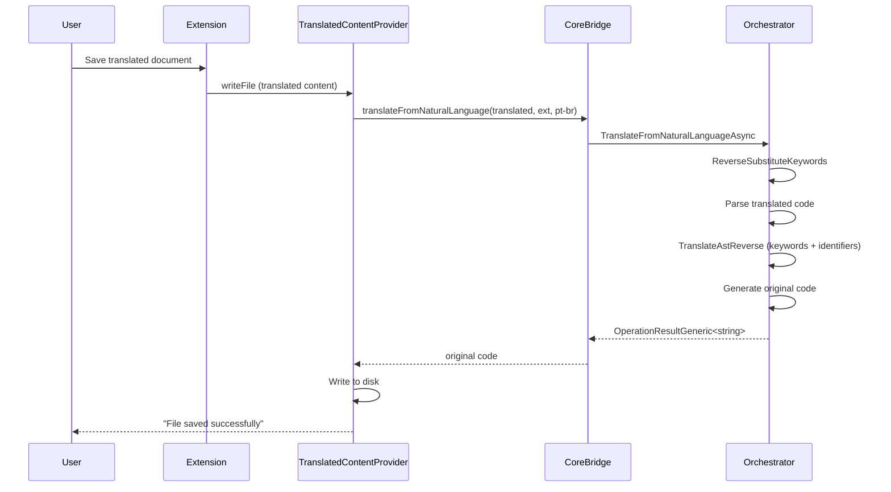

# Arquitetura

## Índice

- [Visão geral](#visão-geral)
- [Camadas](#camadas)
- [Fluxo de tradução](#fluxo-de-tradução)
- [Fluxo reverso](#fluxo-reverso)
- [Decisões de design](#decisões-de-design)

## Visão geral

```
+------------------------------------------+
|          VS Code Extension               |
|  (TypeScript)                            |
|                                          |
|  extension.ts                            |
|  +-- StatusBar                           |
|  +-- Commands (toggle, selectLanguage)   |
|  +-- TranslatedContentProvider           |
|  +-- AutoTranslateManager               |
|  +-- CompletionProvider                  |
|  +-- HoverProvider                       |
|  +-- KeywordMapService                   |
|  +-- LanguageDetector                    |
|  +-- ConfigurationService                |
|  +-- CoreBridge                          |
+------------------+-----------------------+
                   |
            CoreBridge (JSON via stdin/stdout)
                   |
+------------------+-----------------------+
|          Core Engine                     |
|  (C# / .NET 8)                          |
|                                          |
|  TranslationOrchestrator                 |
|  +-- LanguageRegistry                    |
|  +-- NaturalLanguageProvider             |
|  +-- IdentifierMapper                    |
|  +-- TraduAnnotationParser               |
+------------------+-----------------------+
                   |
+------------------+-----------------------+
|          Language Adapters               |
|                                          |
|  CSharpAdapter (Roslyn)                  |
|  +-- RoslynWrapper                       |
|  +-- CSharpKeywordMap                    |
|                                          |
|  PythonAdapter (subprocesso CPython)     |
|  +-- PythonTokenizerService              |
|  +-- PythonKeywordMap                    |
|  +-- tokenizer_service.py               |
|                                          |
|  VisuAlgAdapter / PortugolStudioAdapter  |
|  +-- Text Scan (ITextScannable)          |
+------------------+-----------------------+
                   |
+------------------+-----------------------+
|          Data Layer                      |
|                                          |
|  programming-languages/                  |
|    csharp/, python/,                     |
|    visualg/, portugolstudio/             |
|      keywords-base.json                  |
|  natural-languages/                      |
|    pt-br/csharp.json, python.json,       |
|      visualg.json, portugolstudio.json   |
|    (10 idiomas x 4 linguagens)           |
+------------------------------------------+
```

## Camadas

| Camada | Responsabilidade | Tecnologia |
|--------|-----------------|------------|
| Presentation | UI, commands, status bar | TypeScript / VS Code API |
| Providers | Content, auto-translate, completion, hover, keyword map | TypeScript |
| CoreBridge | Comunicação TS <-> C# | JSON via stdin/stdout |
| Orchestration | Coordenar tradução | C# |
| Adapters | Parsear/gerar código | Roslyn (C#), subprocesso CPython (Python), Text Scan (VisuAlg/Portugol) |
| Data | Tabelas de tradução | JSON |

## Fluxo de tradução

O Orchestrator tem dois caminhos de tradução:

### Fast path: Text Scan (arquivos sem tradu)

Para a maioria dos arquivos (sem anotações `// tradu`), o Text Scan faz
tradução linear de keywords em 0-1ms para qualquer tamanho de arquivo.

```
User opens .cs/.py → Extension → CoreBridge → Orchestrator
  → Detect: no "tradu" in source
  → Build keyword translation map (adapter + provider)
  → TextScanTranslator.Translate(source, map)
    → Scan linear O(n): skip strings, comments, preprocessor, raw strings
    → Replace keywords with translated equivalents
  → Return translated code (0-1ms)
```

### Full path: Roslyn AST (arquivos com tradu)

Para arquivos com anotações tradu, o Roslyn parseia a AST completa
para encontrar e traduzir identifiers além de keywords.

```
User opens .cs/.py → Extension → CoreBridge → Orchestrator
  → Detect: "tradu" found in source
  → ApplyTraduAnnotations (extract identifier mappings)
  → Adapter.Parse(source) → ASTNode tree
  → Clone AST
  → TranslateAstForward (keywords + identifiers)
  → Adapter.Generate(translatedAst)
  → Return translated code (35-4077ms depending on file size)
```

### Performance (benchmark real, mesma API)

| Linhas | Sem tradu (Text Scan) | Com tradu (Roslyn) | Speedup |
|--------|----------------------|-------------------|---------|
| 435 | 0ms | 35ms | 35x |
| 1710 | 0ms | 162ms | 162x |
| 8510 | 0ms | 1031ms | 1031x |
| 17010 | 1ms | 4077ms | 4077x |

## Fluxo reverso


```mermaid
sequenceDiagram
    participant U as User
    participant E as Extension
    participant TCP as TranslatedContentProvider
    participant CB as CoreBridge
    participant O as Orchestrator

    U->>E: Save translated document
    E->>TCP: writeFile (translated content)
    TCP->>CB: translateFromNaturalLanguage(translated, ext, pt-br)
    CB->>O: TranslateFromNaturalLanguageAsync
    O->>O: ReverseSubstituteKeywords
    O->>O: Parse translated code
    O->>O: TranslateAstReverse (keywords + identifiers)
    O->>O: Generate original code
    O-->>CB: OperationResultGeneric<string>
    CB-->>TCP: original code
    TCP->>TCP: Write to disk
    TCP-->>U: "File saved successfully"
```

## Decisões de design

1. **Arquivo no disco sempre original** (DT-003): Tradução é puramente visual
2. **Comunicação via processo** (DT-002): stdin/stdout JSON, sem portas de rede
3. **IDs numéricos para keywords** (DT-005): Desacopla linguagem de programação da tradução
4. **Anotações tradu** (DT-006): Tradução de identificadores definida pelo desenvolvedor
5. **Roslyn para C#** (DT-001): Parser oficial da Microsoft
6. **Subprocesso CPython para Python**: Tokenizador nativo garante 100% compatibilidade
7. **OperationResult pattern**: Sem exceptions, tratamento explícito de erros
8. **TraduAnnotationParser agnóstico**: Desacoplado do Roslyn, funciona com qualquer adapter

Ver detalhes completos em [Decisões Técnicas](../decisoes-tecnicas.md).
